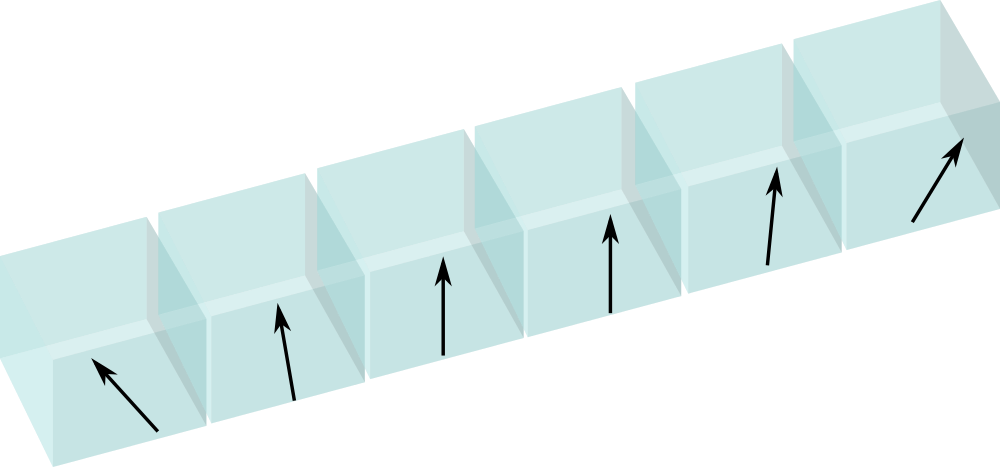
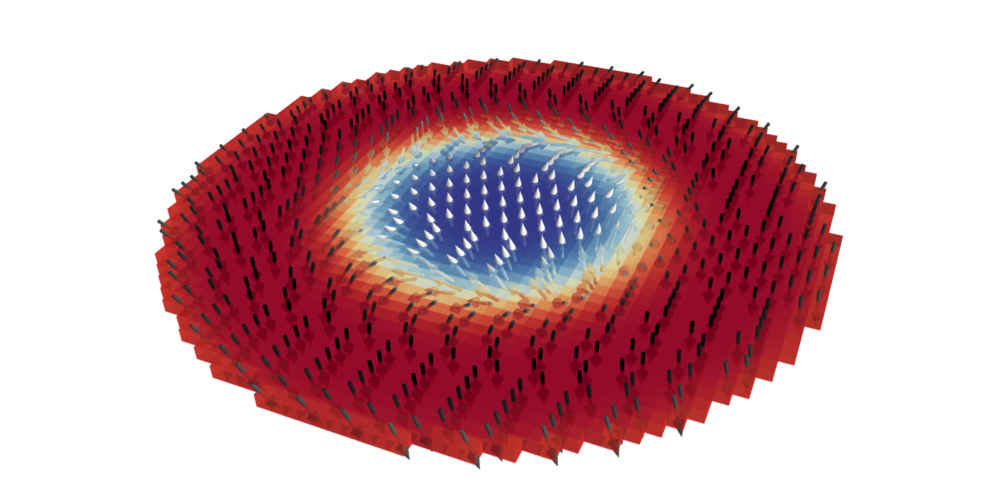
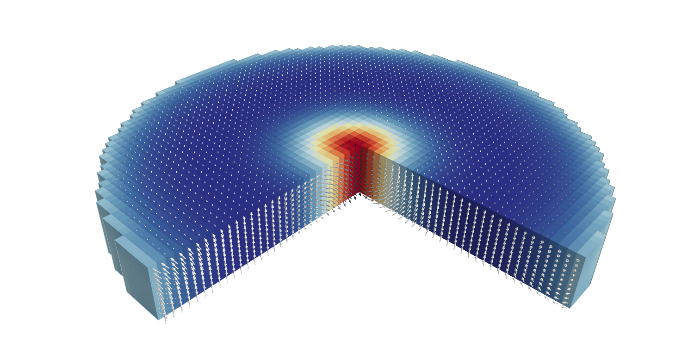
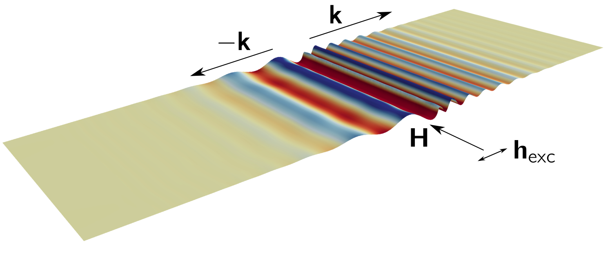

# paper-supplement-standard-problem-dmi

Electronic and additional information for manuscript on micromagnetic standard
problem DMI

Authors: D. Cortés-Ortuño, M. Beg, V. Nehruji, L. Breth, R. Pepper, T. Kluyver,
G. Downing, T. Hesjedal, P. Hatton, T. Lancaster, R. Hertel, G.  Balakrishnan,
O. Hovorka and H. Fangohr

This repository contains scripts and notebooks to reproduce the four standard
problems specified in the paper. The majority of the problems are specified
with a material based on Permalloy (Py):

    D     :: 3     mJ m^-2  
    A     :: 13    pJ m^-1  
    Ms    :: 0.86  MA m^-1  
    Ku    :: 0.4   MJ m^-3   

## One-dimensional problem

A 100 nm  x 5 nm x 5 nm wire made of a Py-like material



## Two-dimensional problem

A 100 nm wide and 2 nm thick disk made of a Py-like material



## Three-dimensional problem

A 180 nm wide and 20 nm thick FeGe cylinder under an applied field `B`



Material parameters are

    D     :: 1.58   mJ m^-2  
    A     :: 8.78   pJ m^-1  
    Ms    :: 0.384  MA m^-1
    B     :: 0.4    T

## Dynamics problem

Calculation of the spin wave-spectrum of a Py-like thin film with
Dzyaloshinkii-Moriya interactions.



# Simulations

In the `notebooks` folder there is a notebook for every standard problem.
Fidimag and OOMMF simulations can be run directly from the notebooks.  

MuMax3 simulations can be run from the `Makefile` in the `sims/MUMAX3/` folder,
which automatically converts `OVF` files into readable formats to analyse the
data in the notebooks. These simulations are in a separate folder since
MuMax3 requires a proper installation with a working NVidia graphics card.

Simulations for the calculation of spin wave spectra are computationally
intensive, thus they can be run separately from the scripts and `Makefile`s in
the `sims/spin_waves_sims/` folder. Some of these scripts are called from the
corresponding notebook with the analysis of the data of the dynamics problem.
Tools to process the data from spin wave simulations can be found in the
`sims/spin_waves_sims/data_libs/` folder.

# Binder

It is possible to interactively run the simulations and analyse the data from a
Jupyter notebook server provided by `Binder`. For this it is only necessary to
click on the badge at the top of this documentation. The server only allows
to run Fidimag and OOMMF simulations at the moment.

# Citation

To cite this repository refer to:

```
@misc{Cortes2018,
  author       = {David Cortés-Ortuño and Marijan Beg and Vanessa Nehruji and
                  Leoni Breth and Ryan Pepper and Thomas Kluyver and
                  Gary Downing and Thorsten Hesjedal and Peter Hatton and 
                  Tom Lancaster and Riccardo Hertel and Geetha Balakrishnan and
                  Ondrej Hovorka and Hans Fangohr},
  title        = {Data set for: Proposal for a micromagnetic standard problem 
                  for materials with Dzyaloshinskii-Moriya interaction},
  month        = apr,
  year         = 2018,
  doi          = {10.5281/zenodo.1174311},
  url          = {http://dx.doi.org/10.5281/zenodo.1174311}
}
```

